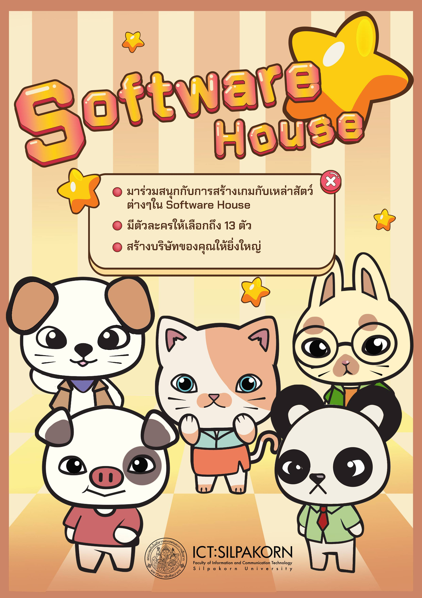

# About me
## *Promote Final Project*

        
## เรียนเชิญร่วมทดลองเกม final project
### 10.30 น. ณ เซียร์รังสิต วันที่ 13 กุมภาพันธ์ พ.ศ.2563
  
---
  
## *ชีวประวัติ ผู้พัฒนา*
        สวัสดีครับผมชื่อเซนครับ ปัจจุบันผมศึกษาอยู่ที่มหาวิทยาลัยศิลปากร คณะเทคโนโลยีสารสนเทศ สาขาออกแบบ เอกการออกแบบเกม ปี 4 ตอนนี้ผมเหลือเวลาในการเป็นนักศึกษาป.ตรี อีกประมาณ 3 เดือนนับจากวันที่เขียนบทความนี้

        ก่อนอื่นเลย ผมต้องขออธิบายก่อนว่าทำไมผมถึงเลือกศีกษาที่คณะ ICT เอกการออกแบบเกม ต้องขอย้อนกลับไป ตอนผมอายุ 16 หรือ 17 ก็เรียกได้ว่าเป็นช่วงโค้งสุดท้ายก่อนเข้ามหาลัย ช่วงนั้นไม่มีอะไรในหัวเลยครับ ไม่รู้ว่าจะเรียนอะไร หรือจะประกอบอาชีพอะไรในอนาคต แทบจะเรียกได้ว่าอนาคตมืดมนสุดๆ ก็เลยนึกย้อนกลับไปตอนที่ยังเป็นเด็กครับว่า อะไรบ้างนะที่ทำให้เรามีความสุข อย่างน้อยเราก็จะได้เลือกเรียนในสิ่งนั้น แล้วก็นึกย้อนกลับไปได้อีกครับ
    (ย้อนในย้อน มีความ Inception 5555)
---
        ตอนผมอายุประมาณ 11 หรือ 12 ได้ ช่วงนั้นก็ตามประสาเด็กขี้เกียจแหละครับ ไม่สนใจเรียน เล่นแต่เกม 55555 แต่สื่งที่ทำให้ผมแตกต่างกับเด็กคนอื่นเลยคือ ผมไม่ได้เล่นอย่างเดียวครับ ผมสนใจในการสร้าง และปรับแต่งตัวเกมด้วย ทุกคนคงรู้จักเกม Ragnarok ใช่ไหมครับ ผมเริ่มจากการเปิดเซิฟเวอร์ Ragnarok ส่วนตัว (ก็เซิฟเถื่อนนั่นแหละครับ 5555) เล่นกับเพื่อนๆ ในห้อง เริ่มที่จะ Custom ตัวเซิฟปรับเปลี่ยนค่านู่น ค่านี่ เขียน Npc และ Map เพิ่มเอง จาก Tool ในช่วงนั้นเริ่มรู้สึกว่าตัวเองมีความสุขครับ การที่ได้เห็นเพื่อนๆ เล่นเซิฟที่เราเป็นคนดัดแปลง เห็นเพื่อนๆ หัวเราะ และหัวร้อน จากการกระทำของเรา และก็เป็นพระเจ้าขนาดย่อมๆ เพราะสามารถสร้าง และเพิ่มอะไรก็ได้ที่เราต้องการ มันทำให้ผมมีความสุขมากๆ ตอนช่วงที่ลองทำเซิฟเวอร์ Ragnarok ช่วงนั้นยังเขียนโค้ดไม่เป็นครับ เพราะส่วนมากใช้แต่ Tool แต่ก็พอจะรู้ว่า ถ้าเปลี่ยนค่าตรงนี้ จะส่งผลกับอะไรบ้างในเกม ต่อมาก็เริ่มเบื่อ Ragnarok ครับ เลยลองขยับไปเกมอื่นดูบ้าง ก็จะมีเช่นเกม ECO (Emil chronicle online), GTA Online (GTA Sandreas) แต่ก็ยังคง Concept เขียนโค้ดไม่เป็นเหมือนเดิมครับ 55555

        เคยได้ยินไหมครับคำที่ ว่าถ้าเราคิดอยากจะเป็นอะไรตอนเด็ก โตมาเราก็จะเป็นอย่างนั้นจริงๆ ก็ตอนช่วงอายุ 12 นี่แหละครับ ที่ผมคิดว่าอยากที่จะเป็นโปรแกรมเมอร์ ตอนช่วงเรียนที่ ม.ศิลปากร ผมตั้งใจเรียนวิชาโปรแกรมมิ่งทุกตัว อย่างสุดความสามารถ และผลลัพธ์ที่ออกมาก็ค่อนข้างพอใจครับ แต่ว่าผมก็ยังไม่หยุดแค่นั้นครับ ต้องขออธิบายก่อนว่ารุ่นที่ผมเรียนนั้นค่อนข้างที่จะเทไปในทางการใช้ Unity Engine ครับ ไม่ค่อยหลากหลายด้วยสาเหตุหลายประการ แต่ในระหว่างที่ศึกษานั้นผมก็ได้ศึกษาศาสตร์อื่นๆ นอกเหนือจากสายเกมไปด้วยครับ เช่น AI, ML, Data-sci, NoSQL Database, Cloud Server, Aduino และอื่นๆ จะเห็นได้ว่าผมพยายามเรียนรู้หลายๆ ด้าน เพื่อที่วันหนึ่งผมจะได้เตรียมรับมือ Project ได้หลากหลายชนิด หรืออุดรอยรั่วของ Project ที่อาจจะเกิดขึ้นในอนาคตด้วยความรู้ด้านอื่นๆ ครับ
---
        ท้ายที่สุดนี้ผมค่อนข้างเข้าใจตัวเองครับว่า ผมไม่ใช่คนฉลาด แต่ผมเป็นคนที่พร้อมที่จะเรียนรู้สิ่งใหม่ๆ อยู่ตลอดเวลา และถ้าผมคิดที่จะทำอะไรแล้ว ผมจะไม่ยอมแพ้ ไม่ล้มเลิก จนกว่าผมจะทำมันสำเร็จครับ
  
  
#### *อันนี้คือเว็บ Portfolio ที่ลองทำเมื่อปีที่แล้ว ทำการทดสอบ Deploy ใน Google App Engine ครับ*
[website-zen](http://www.website-zen.appspot.com/)  
<!-- *test*  
**test**  
***test***  
_test_  
__test__  
___test___   -->
> -
>> -
>>> -
>>>> -
>>>>> -
>>>> -
>>> - 
>> - 
> -
##### สิ่งที่คาดหวังในปี 2020
1. นอนให้เต็มอิ่ม
2. เรียนให้เต็มที่
3. ใช้เงินให้คุ้ม

##### สิ่งที่ต้องทำในปี 2020
- [ ] _ไปฝึกงานที่ญี่ปุ่น_  
- [ ] ทำการบ้าน Oak code kata  
- [X] งดนอนเช้า

- content
- content
- content  
    - child
        - child
            - child

| header 1 | header 2 |
| :-:|:-: |
| content | content |
| content | content |